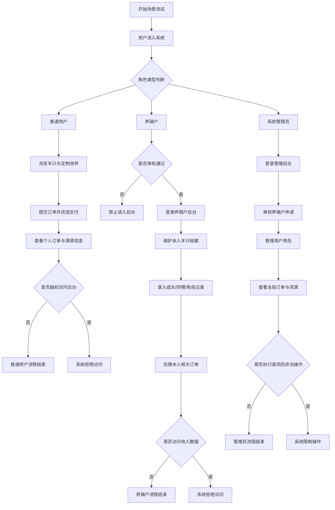
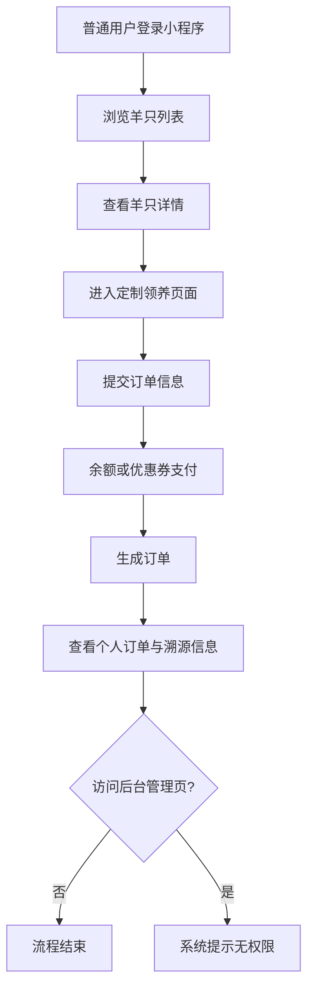
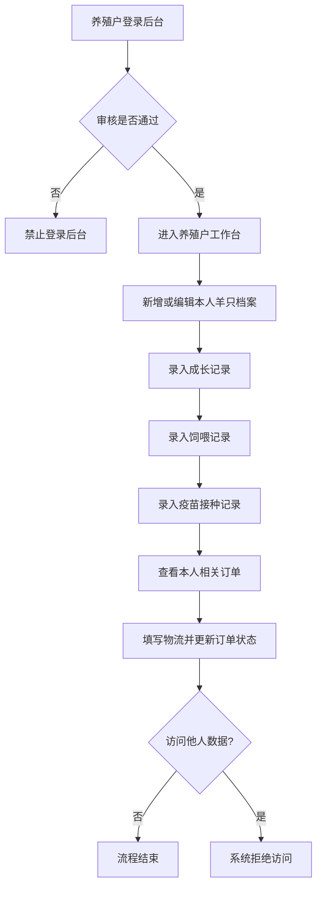
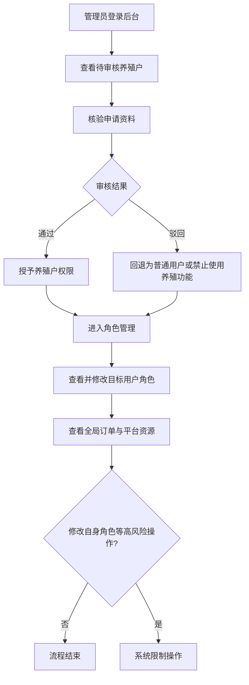

# 6.X 场景测试

场景测试主要从系统实际使用过程出发，验证不同角色在各自权限范围内能否顺利完成对应业务操作，并检查系统是否能够对越权访问进行有效拦截。结合本系统的权限设计，平台角色划分为普通用户、养殖户和系统管理员三类，因此本文按照角色划分场景测试内容，对三类角色在真实业务环境下的操作链路进行验证。

## 6.X.1 普通用户场景测试

普通用户的核心业务是浏览羊只、提交领养订单、支付结算以及查看个人订单和溯源信息，因此测试围绕“浏览羊只信息-发起定制领养-提交订单-查看订单与溯源”的完整链路展开。

**测试内容**

1. 用户登录小程序后浏览羊只列表与详情信息。
2. 用户根据需求进入定制领养页面，选择目标羊只并提交订单。
3. 用户填写收货信息，选择余额或优惠券完成支付。
4. 支付完成后查看个人订单状态及对应羊只档案信息。
5. 用户尝试访问后台管理页面，验证系统是否进行权限拦截。

**预期结果**

1. 普通用户能够正常浏览羊只信息并进入详情页。
2. 用户能够正常提交订单，系统可正确生成订单记录。
3. 余额支付、优惠券抵扣等结算功能运行正常。
4. 用户仅能查看自己的订单和相关溯源信息。
5. 当普通用户尝试访问后台管理页面时，系统应提示无权限访问。

**测试结论**

测试结果表明，普通用户可以在自身权限范围内完成羊只浏览、定制领养、订单支付和信息查询等操作，系统同时能够有效阻止其访问后台管理功能，说明普通用户侧业务流程完整，权限边界控制有效。

## 6.X.2 养殖户场景测试

养殖户的核心业务是维护羊只档案、录入养殖过程数据以及处理与本人羊只相关的订单，因此测试围绕“登录后台-维护羊只档案-维护养殖记录-处理订单”的业务闭环展开。

**测试内容**

1. 已审核通过的养殖户登录后台管理系统。
2. 养殖户新增、编辑本人名下羊只基础档案。
3. 养殖户录入成长记录、饲喂记录和疫苗接种记录。
4. 养殖户查看与本人羊只相关的订单详情，并填写物流信息、更新订单状态。
5. 养殖户尝试访问或修改其他养殖户名下的数据，验证系统是否拦截。

**预期结果**

1. 未审核通过的养殖户不能进入后台，审核通过后方可登录。
2. 养殖户能够正常维护本人名下羊只基础信息。
3. 养殖户能够正常录入并查看成长、饲喂和免疫等养殖数据。
4. 养殖户只能处理与本人羊只相关的订单，物流与状态更新能够正确保存。
5. 对其他养殖户数据的访问、编辑或订单处理请求应被系统拒绝。

**测试结论**

测试结果表明，养殖户在审核通过后能够顺利完成羊只档案维护、养殖记录管理和订单处理等操作，且系统能有效限制其访问非本人数据，说明养殖户角色的数据归属控制和权限控制机制运行正常。

## 6.X.3 系统管理员场景测试

系统管理员主要承担平台治理职责，包括养殖户审核、角色管理和全局资源管理，因此测试围绕“审核养殖户申请-管理用户角色-查看全局订单与资源”的管理链路展开。

**测试内容**

1. 管理员登录后台后查看待审核养殖户列表。
2. 管理员进入审核详情页，核验申请资料并执行通过或驳回操作。
3. 管理员查看用户列表并修改目标用户角色。
4. 管理员查看全部订单及平台资源信息。
5. 管理员尝试修改自身角色等高风险操作，验证系统是否限制。

**预期结果**

1. 管理员能够正常查看养殖户申请信息并完成审核。
2. 审核通过后，目标用户获得正式养殖户权限；驳回后应失去养殖户管理资格。
3. 管理员能够统一管理平台用户角色与权限。
4. 管理员能够查看全局订单、羊只和用户等平台资源信息。
5. 对管理员自身角色修改等高风险操作，系统应进行限制，避免权限异常。

**测试结论**

测试结果表明，管理员可以在平台治理权限范围内完成养殖户审核、用户角色管理和全局资源查看等操作，同时系统对高风险管理行为具备约束机制，说明后台管理权限设计较为完整。

## 6.X.4 综合分析

综合三类角色的场景测试结果可以看出，系统能够较好地支撑普通用户、养殖户和管理员在各自权限范围内完成对应业务操作。各角色既能够顺利完成授权内任务，又无法越权访问不属于自身权限范围的数据和功能，说明本系统在多角色协同、业务流程完整性以及权限隔离方面达到了设计目标。

---

# 流程图

下面给出可直接放入论文的流程图说明。若需要在 Word 中绘制，可按照以下流程节点绘制；若支持 Mermaid，也可直接使用对应源码生成图形。

## 1. 角色场景测试总体流程图

## 2. 普通用户场景流程图

## 3. 养殖户场景流程图

## 4. 管理员场景流程图

